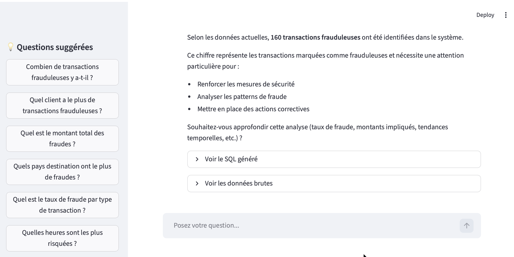
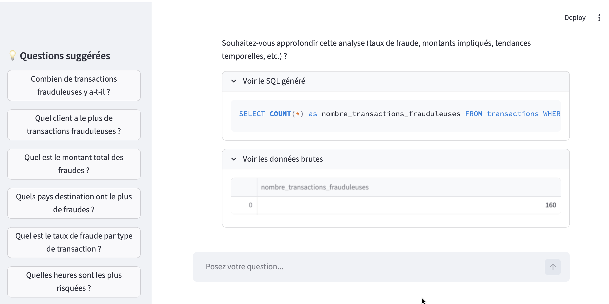
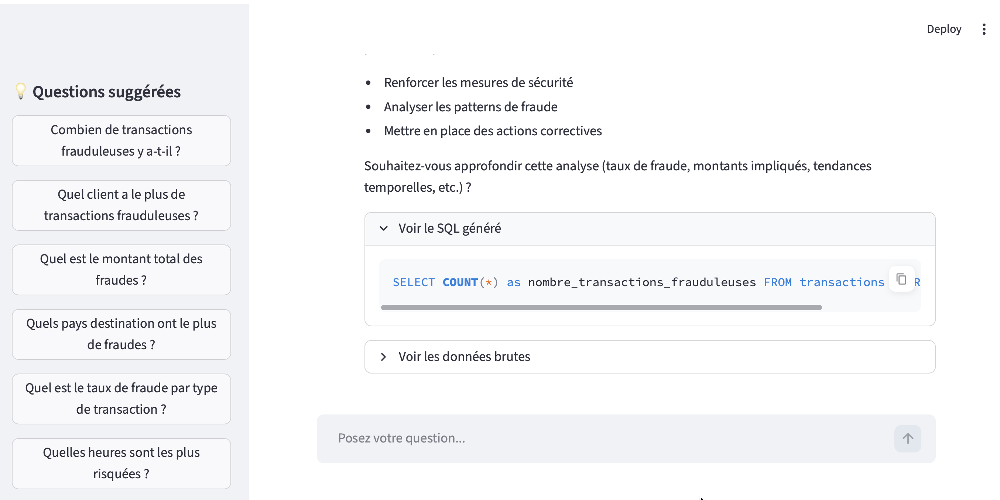

# 🤖 Assistant IA RAG — Fintech Afrique de l'Ouest


Chatbot intelligent qui répond à des questions en langage naturel sur des données financières via **Text-to-SQL** et **LLM**. Conçu pour l'analyse de fraude dans le contexte fintech ouest-africain.

---

## 📸 Screenshots

<p align="center">
  
  
  
</p>

---

## 💡 Démonstration

> **Question :** "Quel client a le plus de transactions frauduleuses ?"
>
> **Réponse :** Aminata Traoré enregistre le plus grand nombre de transactions frauduleuses avec 56 fraudes détectées. Audit immédiat recommandé.
>
> **SQL généré automatiquement :**
> ```sql
> SELECT u.id, u.nom, COUNT(t.id) AS nombre_fraudes
> FROM users u
> JOIN comptes c ON u.id = c.user_id
> JOIN transactions t ON c.id = t.compte_id
> WHERE t.est_fraude = 1
> GROUP BY u.id, u.nom
> ORDER BY nombre_fraudes DESC
> LIMIT 1;
> ```

---

## 🏗️ Architecture

```
Question utilisateur
        ↓
LangChain (orchestration)
        ↓
Claude Haiku — génère le SQL
        ↓
PostgreSQL — exécute la requête
        ↓
Claude Haiku — formule la réponse
        ↓
Streamlit Chat UI
```

---

## 🛠️ Stack technique

| Outil | Rôle |
|-------|------|
| [LangChain](https://www.langchain.com/) | Orchestration LLM + outils |
| [Claude Haiku](https://openrouter.ai/) via OpenRouter | Génération SQL + réponses naturelles |
| [PostgreSQL](https://www.postgresql.org/) | Base de données fintech |
| [SQLAlchemy](https://www.sqlalchemy.org/) | Connexion et exécution SQL |
| [Streamlit](https://streamlit.io/) | Interface chat interactive |

---

## ✨ Fonctionnalités

- **Text-to-SQL automatique** — pose une question, le LLM génère le SQL
- **Réponses en langage naturel professionnel** en français
- **Affichage du SQL généré** pour la transparence
- **Questions suggérées** dans la sidebar pour démarrer rapidement
- **Historique de conversation** persistant dans la session
- **Données brutes** accessibles en un clic (tableau interactif)

---

## 💬 Exemples de questions

- "Combien de transactions frauduleuses y a-t-il ?"
- "Quel est le montant total des fraudes ?"
- "Quels pays destination ont le plus de fraudes ?"
- "Quel est le taux de fraude par type de transaction ?"
- "Quelles heures sont les plus risquées ?"
- "Quel client a le solde le plus élevé ?"

---

## 🚀 Lancer le projet

### ⚡ Avec Docker (recommandé)

**Prérequis :** [Docker](https://www.docker.com/) + clé API [OpenRouter](https://openrouter.ai/)

```bash
# 1. Cloner le projet
git clone https://github.com/SeydinaBANE/rag-fintech.git
cd rag-fintech

# 2. Configurer les variables d'environnement
cp .env.example .env
# Renseigner OPENROUTER_API_KEY, DB_USER, DB_PASSWORD dans .env

# 3. Démarrer (app + PostgreSQL + données de test)
docker compose up --build
```

Ouvre [http://localhost:8502](http://localhost:8502)

> La base de données est initialisée automatiquement avec le schéma et des données de test via `init.sql`.
> Pour utiliser tes propres données, remplace `init.sql` par un export `pg_dump` de ta base.

---

### 🛠️ En local (sans Docker)

**Prérequis :** Python 3.11+, [uv](https://docs.astral.sh/uv/), PostgreSQL sur le port 5433

```bash
git clone https://github.com/SeydinaBANE/rag-fintech.git
cd rag-fintech

cp .env.example .env
# Renseigner toutes les variables dans .env

make install     # installe toutes les dépendances (prod + dev)
make db-up       # démarre uniquement le conteneur PostgreSQL
make run         # lance Streamlit sur :8502
```

Ouvre [http://localhost:8502](http://localhost:8502)

---

## 🧪 Développement

```bash
make test        # lance pytest (aucune connexion DB ou LLM requise)
make coverage    # pytest + rapport de couverture (seuil 70 %, rapport HTML dans htmlcov/)
make lint        # ruff check
make format      # ruff format
make check       # lint + test (utilisé en CI)
```

Les hooks pre-commit (lint + format) s'installent automatiquement avec `make install` et s'exécutent à chaque `git commit`.

Les **dépendances sont mises à jour automatiquement** par Dependabot chaque lundi (pip + GitHub Actions).

---

## 📁 Structure du projet

```
projet-rag-fintech/
├── .github/
│   ├── workflows/
│   │   ├── ci.yml             # Lint + tests + coverage (seuil 70 %)
│   │   └── cd.yml             # Build & push image Docker (ghcr.io), gatée sur CI
│   ├── dependabot.yml         # Mises à jour automatiques des dépendances
│   └── PULL_REQUEST_TEMPLATE.md  # Template PR
├── rag/
│   └── engine.py              # Moteur RAG — pipeline Text-to-SQL
├── dashboard/
│   └── app.py                 # Interface Streamlit Chat
├── tests/
│   └── test_engine.py         # Tests unitaires (mocks, sans DB)
├── screenshot/                # Captures d'écran de l'interface
├── Dockerfile                 # Image Docker de l'application
├── docker-compose.yml         # Orchestration app + PostgreSQL
├── init.sql                   # Schéma et données de test PostgreSQL
├── Makefile                   # Commandes de développement
├── .pre-commit-config.yaml    # Hooks pre-commit (ruff)
├── .env.example               # Modèle de variables d'environnement
├── pyproject.toml             # Dépendances du projet
└── README.md
```

---

## 🌍 Ce qui rend ce projet unique

Ce projet implémente le pattern **Text-to-SQL avec LLM** — une des compétences les plus recherchées en 2026. Au lieu d'écrire des requêtes SQL manuellement, le LLM comprend la question en langage naturel, génère le SQL approprié, exécute la requête et formule une réponse professionnelle. Applicable dans n'importe quel secteur : banque, télécommunications, retail, santé.

---

## 👤 Auteur

**Seydina Mouhamet BANE**

[](https://www.linkedin.com/in/seydina-mouhamet-bane-4710931a1)
[](https://github.com/SeydinaBANE)
